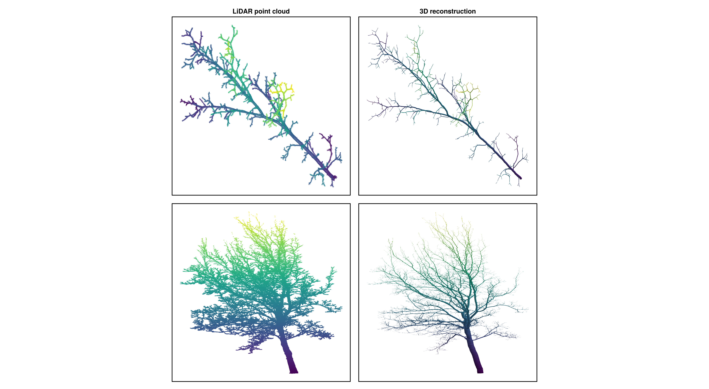

# Tree biomass evaluation using LiDAR

> This is the repository for the code and data used in the paper **Coupling LiDAR and structural models to improve the estimation of aboveground woody biomass** ([preprint](https://hal.archives-ouvertes.fr/hal-03838571)).

The data (+code) is available on a dedicated Zenodo repository [](https://doi.org/10.5281/zenodo.7038482)

## Introduction

Light detection and ranging (LiDAR) is commonly used in forestry for different applications, among which the evaluation of the trees biomass. Different methods exist to evaluate the biomass of a tree from LiDAR data, with varying accuracy, mainly depending on the quality of the data acquisition.

Low-precision LiDAR data is used to get the tree height and crown dimensions that are used to approximate the tree biomass using allometries, while middle-precision to high precision data are used to estimate the tree biomass directly from a reconstruction of the tree structure for the trunk and occasionally the structural branches (*e.g.* see applications of TreeQSM, Plantscan3d or AMAPScan). But usually even high resolution data is not sufficient to estimate the biomass of trees as a whole including smaller branches. This is because LiDAR data is often messy at that scale, due to either the laser footprint that is too high compared to the footprint of the structure of interest, or more simply due to wind or occlusions. The resulting point cloud is often good enough to estimate the topology and the length of almost all the structures, but not enough to estimate their diameters properly, which is crucial to compute the volumes, and then the biomass.

This project is an attempt at finding a new method for the evaluation of the tree biomass including most of the tree structure up to the smaller branches by re-estimating the diameters.

For this purpose we set up an experiment on an agroforestry system where we measured two branches per tree on three trees. The measurements included a LiDAR acquisition, and manual measurements on the branches for their topology, dimensions, biomass and a sampling of their fresh and dry wood density.

The estimation of the volume and biomass from LiDAR data is first done using Plantscan3d, an OpenAlea software used to estimate tree topology and dimensions. The diameters are estimated at each node using the mean-distance algorithm that uses the LiDAR point-cloud directly. This technique is known to generate a high error rate, especially for smaller structures.

A second estimation of the volumes and biomass is done using the pipe model theory (PMT), a well-known method in the field of forestry. The PMT is used to compute the cross-section of the structures based on the cross-section of their bearer. Applying this method recursively, all cross-sections are then estimated, and the volume of the structures can then be computed.

Then, we propose a new method that we name the "structural model", that combines botanical variables and statistics to compute the cross-section of the structures. The variables it uses must be computable from the information we get from the LiDAR reconstruction, namely the topology and lengths of the structures.

The manual measurements are used for two purposes:

- as a database to fit the statistical model of the third method (structural model), and
- as a reference to assess the estimation of the volume and biomass from the different methods cited before



*Figure 1. Co-registered LiDAR point-cloud (left panels) and 3D reconstruction using the structural model (right panels) of a sampled branch (top panels) and a whole tree (bottom panels). Note that the 3D reconstruction was done at the segment level, which implies that the trunk base has only one segment.*

## Project steps

This project is divided into several steps:

1. Compute the MTG data
2. Check the measured length from the LiDAR data is close to the manual measurements. This is crucial as lengths are considered well estimated by LiDAR;
3. Check the integrity of the manual measurements by evaluating if the biomass estimated from manual dimensions measurements (lengths and diameters) at segment scale and an average fresh wood density are close to the reference biomass measured using a scale on the field. This step helps us check if the volumes/biomass estimated using manual measurements can be used as a reference for evaluating the different methods to estimate them from LiDAR point-clouds;
4. Find the variables explaining the cross-section at segment scale and build the structural model;
5. Evaluate the different methods for the estimation of the tree biomass

## Structure

The project is structured into folders for the data (`0-data`), the code (`1-code`) and the outputs (`2-results`).

### Data

All data related to the project are stored in the `0-data` folder. You can find an extensive description of the folders and files structure in the [README file](0-data/README.md) at its root.

### Code

The code related to the project is stored in the `1-code` folder. All computations are made using the Julia programming language and the [MultiScaleTreeGraph.jl](https://vezy.github.io/MultiScaleTreeGraph.jl/dev/) package. The computations are made in pure Julia scripts or [Pluto.jl](https://github.com/fonsp/Pluto.jl) notebooks for interactivity.

To open a notebook, add Pluto to your Julia environment and import it. To do so, open Julia, and type the following:

```julia
using Pkg; Pkg.add("Pluto")
using Pluto
```

Then you can open the notebooks with the commands given below.

- Step 1: The first step is done in two Julia scripts. Open the following scripts in *e.g.* VS Code, and execute the code from the script to repeat the analysis.
  - the first script (`1.1-compute_field_mtg_data.jl`) computes new variables into the manually measured MTG, and export the results as CSV and MTG files in `0-data/1.2-mtg_manual_measurement_corrected_enriched`;
  - the second script (`1.2-mtg_plantscan3d_to_segments.jl`) puts the MTGs from Plantscan3d into the same format as used in the manually-measured MTGs;

- Step 2: Checking estimated length from LiDAR:

```julia
Pluto.run(notebook = "1-code/2-step_3_check_LiDAR_length.jl")
```

- Step 3: Checking manual measurements integrity:

```julia
Pluto.run(notebook = "1-code/3-check_manual_measurement.jl")
```

- Step 4: fit models using all variables that can be computed from LiDAR. To execute the notebook, copy and paste the following command into the Julia REPL:

```julia
Pluto.run(notebook = "1-code/4-model_cross_section.jl")
```

- Step 5: analysis.

  - Axis scale:

    ```julia
    Pluto.run(notebook = "1-code/5.1-axis_scale")
    ```

  - Branch scale:

    ```julia
    Pluto.run(notebook = "1-code/5.2-branch_scale.jl")
    ```

  - Tree scale:

    ```julia
    Pluto.run(notebook = "1-code/5.3-tree_scale.jl")
    ```

  - Visualization in 2D (notebook can be slow, there is a faster script for this in `1-code/5.4-visualization_2d_script.jl`):

    ```julia
    Pluto.run(notebook = "1-code/5.4-visualize_2d.jl")
    ```

  - Visualization in 3D:

    ```julia
    Pluto.run(notebook = "1-code/5.5-visualize_3d.jl")
    ```

  - Visualization of the topology:

    ```julia
    Pluto.run(notebook = "1-code/5.6-visualize_topology.jl")
    ```

### Results

The results are all stored in the `2-results` folder. They are divided into three sub-categories:

- output data (`1-data`): computed data, final results of computations and analyses
- figures (`2-plots`): most interesting plots resulting from analyses
- reports (`3-reports`): outputs from the `Pluto.jl` notebooks.
